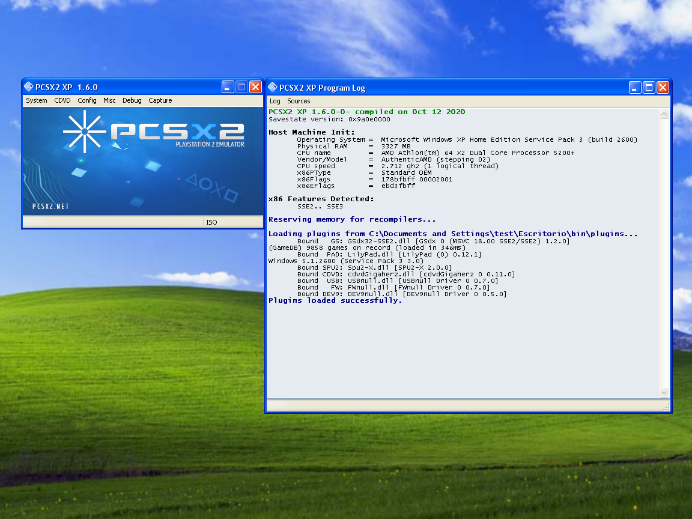

# PCSX2 XP - The PlayStation 2 Emulator

PCSX2 is a free and open-source PlayStation 2 (PS2) emulator. Its purpose is to emulate the PS2's hardware, using a combination of MIPS CPU [Interpreters](<https://en.wikipedia.org/wiki/Interpreter_(computing)>), [Recompilers](https://en.wikipedia.org/wiki/Dynamic_recompilation) and a [Virtual Machine](https://en.wikipedia.org/wiki/Virtual_machine) which manages hardware states and PS2 system memory. This allows you to play PS2 games on your PC, with many additional features and benefits.

As the original developers decided to remove Windows XP support back in 2016, we wanted to bring back compatibility with said operating system. Wasn't an easy task, but now XP users can finally enjoy from the latest version of this great emulator.

## Screenshots

PCSX2 XP running on Windows XP

## System Requirements

#### Minimum
| Windows XP (32 or 64 bits) |
|:-------|
| DirectX Jun2010 Update. Visual C++ 2013 Redistributable. |
| **Any CPU compatible with SSE2:** AMD Athlon II or AMD Phenom. Intel Core 2 Duo. |
| **Any GPU compatible with OpenGL 3.3:** NVIDIA GTS 450. Radeon HD 5770. |
| 2 GB RAM |

#### Recommended
| Windows XP (32 or 64 bits) |
|:-------|
| DirectX Jun2010 Update. Visual C++ 2013 Redistributable. |
| **Processor:** AMD FX-4300. Intel Core i5-2400. |
| **Graphics Card:** NVIDIA GTX 750. Radeon HD 7850. |
| 4 GB RAM |
 

## Released Versions

Latest stable build:
- **Release date:**  12 Oct 2020
- **Version number:**  v1.6.0
- [32bit binary](https://github.com/blueclouds8666/pcsx2_XP/releases/download/v1.6.0/pcsx2-xp-binaries.7z)
- [TAS enabled version](https://github.com/blueclouds8666/pcsx2_XP/releases/download/v1.6.0/pcsx2-xp-tasenabled-binaries.7z)

Also available:
- **v1.5.0-dev from 2018:** [click here](https://github.com/blueclouds8666/pcsx2_XP/tree/release-1.5.0)
- **v1.4.0 from 2016:** [click here](https://github.com/blueclouds8666/pcsx2_XP/tree/release-1.4.0)
 

## Compiling

Building PCSX2 XP from source can be easily done by following [these steps](COMPILE.md).

If you are adventurous, you might want to try the [experimental compiling guide](COMPILE-TESTING.md).
 
 

## Dev team

GitHub name | Email address
--- | ---
blueclouds8666 | blueclouds8666@mail.com 

PCSX2 XP has been brought to you by the NEONFLOPPY Team. Check our website at [neonfloppy.sytes.net](http://neonfloppy.sytes.net)

 
 
